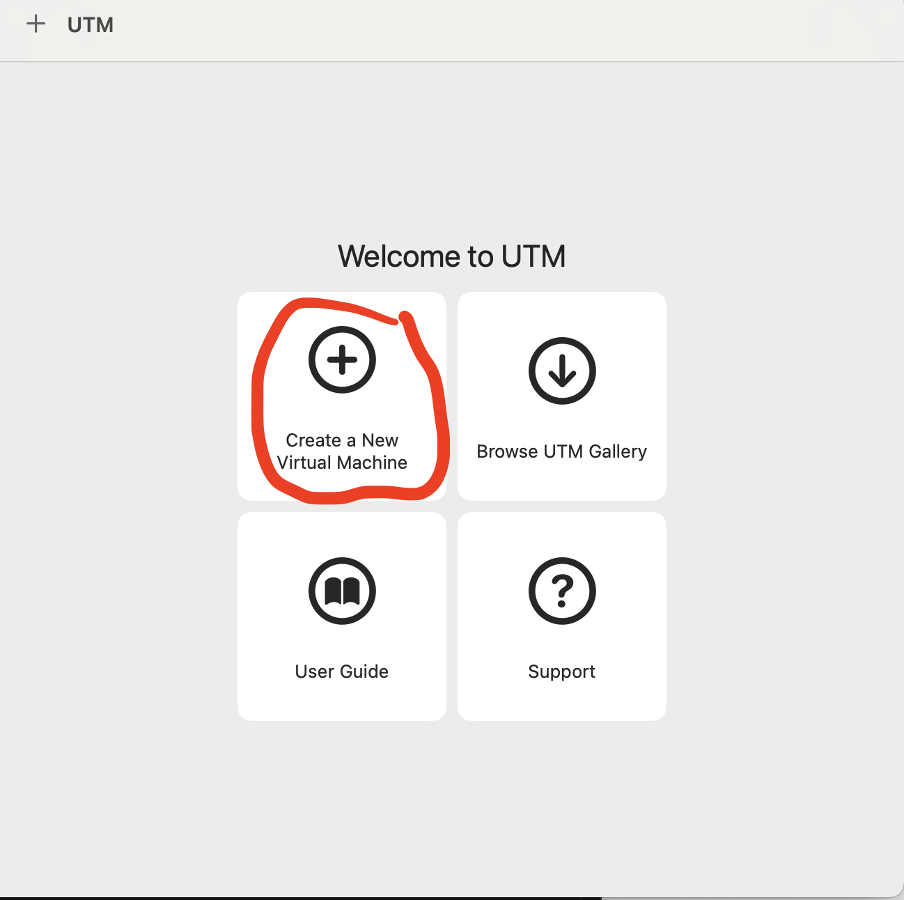
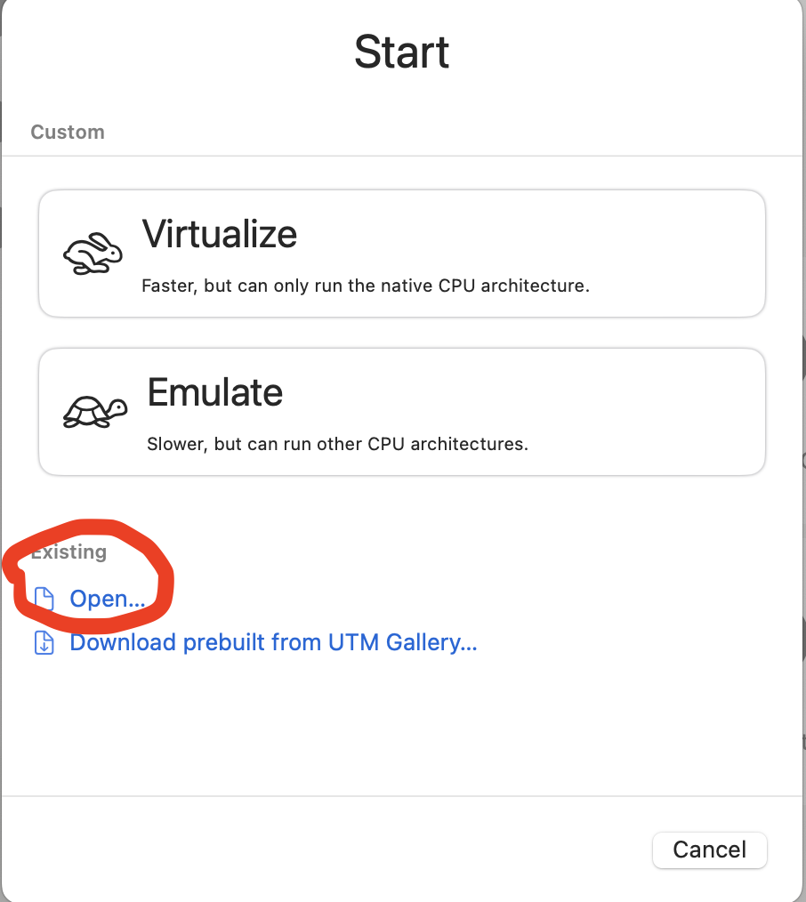
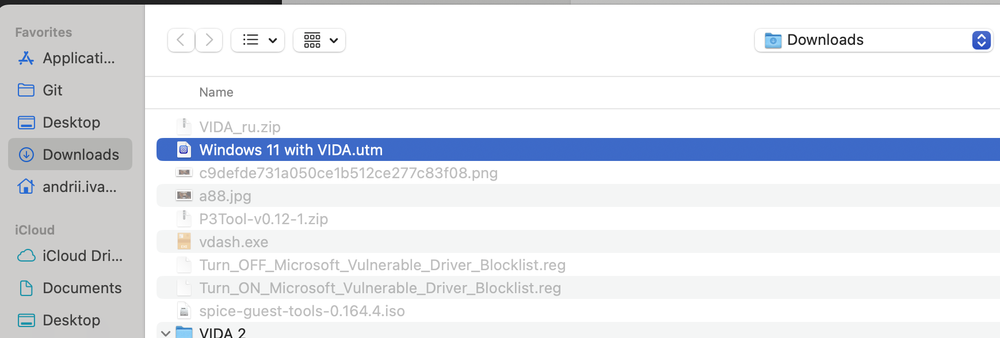
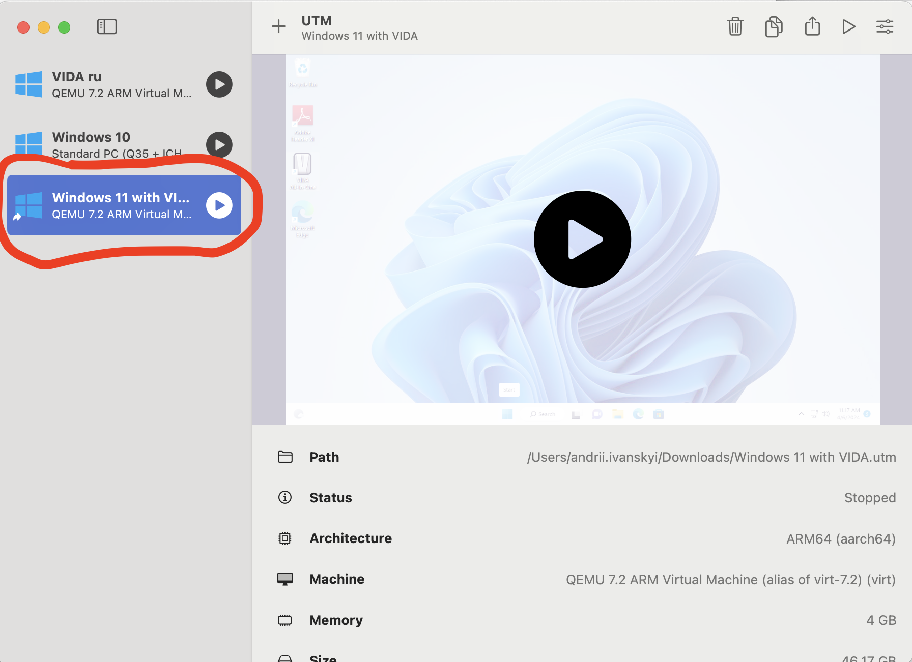
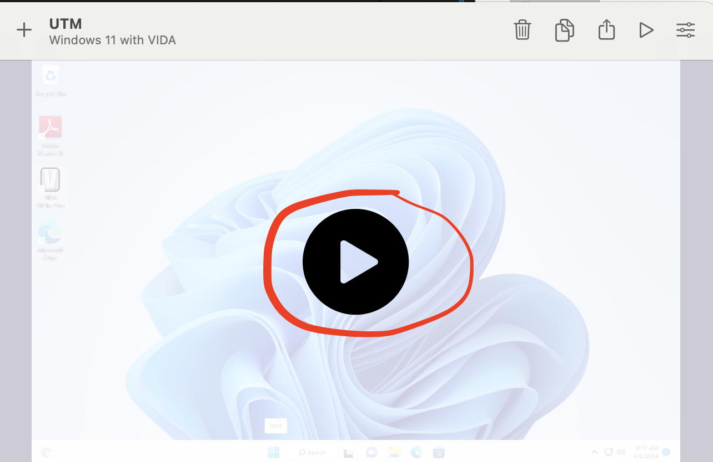
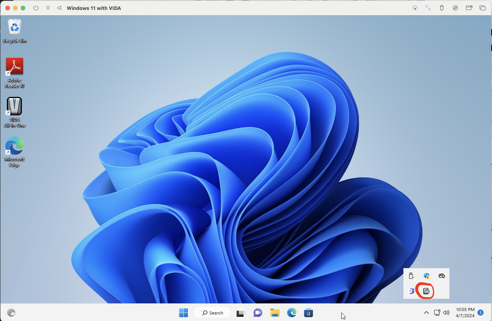
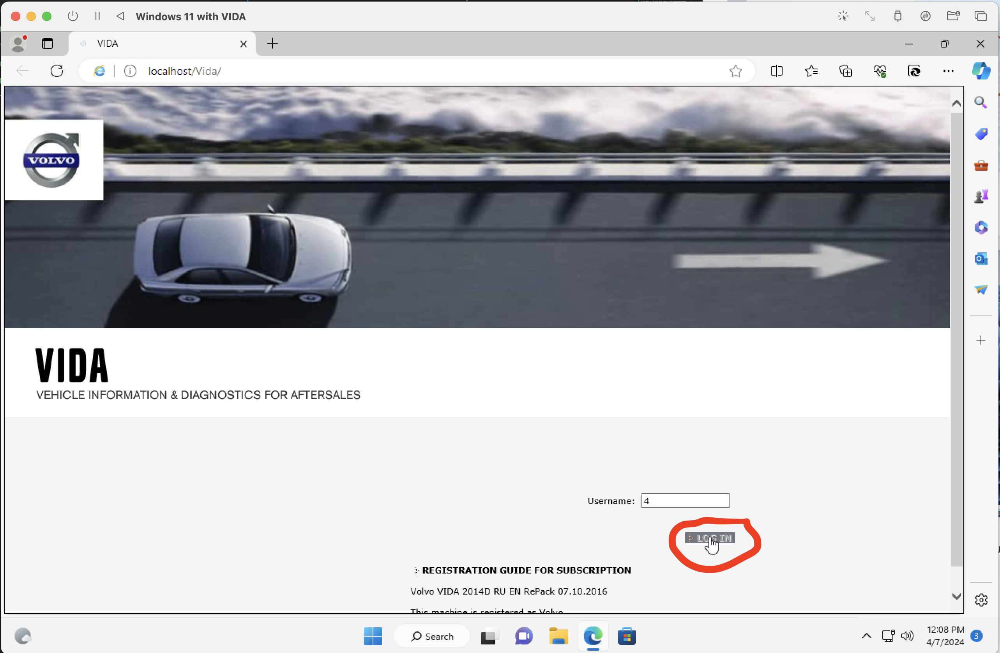
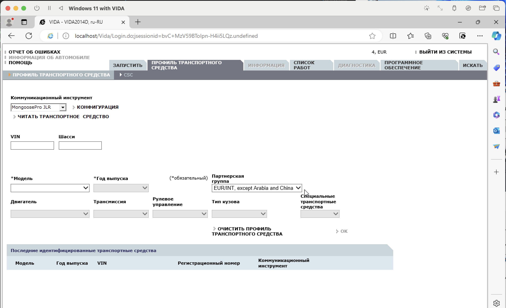

# VIDA на MacOS

## Установка UTM

- ставимо пакетний менеджер `brew` - за його допомогою будемо інсталювати UTM і всі необхідні залежності

Відкриваємо Terminal і виконуємо команду:

```
  /bin/bash -c "$(curl -fsSL https://raw.githubusercontent.com/Homebrew/install/HEAD/install.sh)"
 ```

- ставимо Xcode 

```
 xcode-select --install
``` 

- нарешті, запускаємо установку UTM

```
brew install utm
```

## Створення віртуальної машини з готового образу VIDA

- Завантажуємо образ віртуальної машини з уже встановленою та налаштованою VIDA

- Розпаковуємо архів, відкриваємо UTM, створюємо нову віртуальну машину



- На наступному кроці обираємо відкрити існуючий образ і вказуємо шлях до раніше розпакованого файлу







- Запускаємо віртуальну машину



- Чекаємо поки стартує сервіс VIDA



- Відкриваємо VIDA, вводимо логін (наприклад, 4) - PROFIT!



- Додаємо профіль свого авто і можна користуватись


